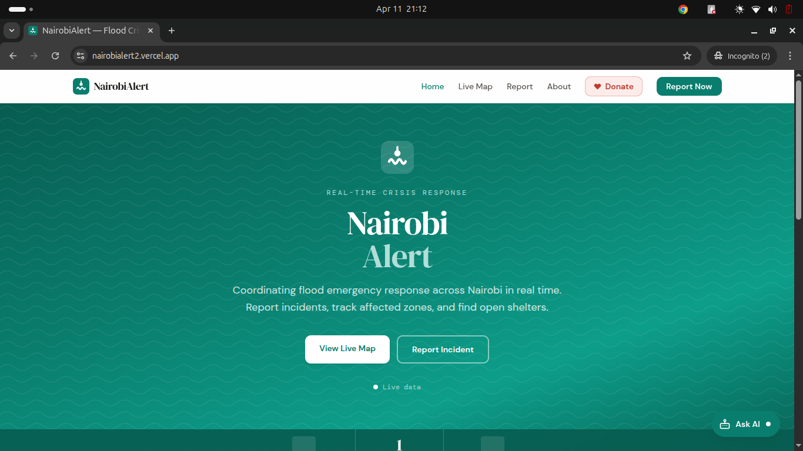

# NairobiAlert — Flood Crisis Response Platform

<div align="center">

![NairobiAlert]

**Real-time flood crisis coordination for Nairobi, Kenya.**  
Connecting citizens, emergency responders, and administrators across web, SMS, and USSD.

[**Live App**](https://nairobialert2.vercel.app) · [Report an Incident](https://nairobialert2.vercel.app/report) · [Live Map](https://nairobialert2.vercel.app/map)

</div>

---

## Table of Contents

- [Overview](#overview)
- [Architecture](#architecture)
- [Technology Stack](#technology-stack)
- [Repository Structure](#repository-structure)
- [Getting Started](#getting-started)
- [Environment Variables](#environment-variables)
- [Public Features](#public-features)
  - [Home Page](#home-page)
  - [Live Map](#live-map)
  - [Report Incident](#report-incident)
  - [About](#about)
  - [Navbar & Footer](#navbar--footer)
- [Admin Panel](#admin-panel)
  - [Login](#login)
  - [Dashboard](#dashboard)
  - [Incident Management](#incident-management)
  - [Teams Management](#teams-management)
  - [Shelters Management](#shelters-management)
- [AI Chatbot](#ai-chatbot)
- [Donation System](#donation-system)
- [Firebase Architecture](#firebase-architecture)
  - [Firestore Collections](#firestore-collections)
  - [Real-Time Subscriptions](#real-time-subscriptions)
  - [Offline Persistence](#offline-persistence)
- [Security — Firestore Rules](#security--firestore-rules)
- [PWA & Offline Support](#pwa--offline-support)
- [CI/CD Pipeline](#cicd-pipeline)
- [SMS / USSD Architecture](#sms--ussd-architecture)
- [Performance & Accessibility](#performance--accessibility)
- [Contributing](#contributing)
- [Credits & Licence](#credits--licence)

---

## Overview

NairobiAlert is a real-time flood crisis response and coordination platform built specifically for Nairobi, Kenya. It connects three actors — **citizens**, **emergency response teams**, and **administrators** — through a unified system operating across multiple access channels: a full-featured PWA, an SMS shortcode, and a USSD dial code.

The platform was engineered around the infrastructure constraints of Nairobi's flood-prone informal settlements — **Kibera**, **Mathare**, and **Mukuru** — where limited smartphone penetration, intermittent 2G connectivity, and lack of coordinated real-time information create compounding risks during flood events.

### Core Capabilities

| Capability | Detail |
|---|---|
| **Multi-channel reporting** | Web form, SMS `22384`, USSD `*384#` |
| **Real-time coordination** | Firestore `onSnapshot` subscriptions — zero polling |
| **Admin verification workflow** | `pending → open → rejected → resolved` |
| **Live spatial map** | Leaflet.js with severity-coded incident markers and shelter overlays |
| **AI crisis assistant** | Gemini Flash chatbot scoped to NairobiAlert operations |
| **Donation processing** | Paystack (KES-first, M-Pesa + card) |
| **Offline-first** | PWA with Service Worker + Firestore IndexedDB persistence |
| **CI/CD** | GitHub Actions build validation + Vercel auto-deploy |

---

## Architecture

NairobiAlert is a client-rendered SPA backed entirely by Google Firebase. There is no custom backend server — all business logic runs in the React client or Firebase Cloud Functions.

```
┌─────────────────────────────────────────────────────────────┐
│                        CLIENT (React + Vite)                │
│  PublicLayout          AdminLayout (ProtectedRoute)         │
│  ├── Home              ├── Dashboard                        │
│  ├── Map               ├── Incidents                        │
│  ├── Report            ├── Teams                            │
│  ├── About             └── Shelters                         │
│  ├── AIChatbot (Gemini Flash)                               │
│  └── DonationModal (Paystack)                               │
└──────────────────────┬──────────────────────────────────────┘
                       │ Firebase SDK
        ┌──────────────┼──────────────────┐
        ▼              ▼                  ▼
   Firestore       Firebase Auth    Cloud Functions
 (real-time DB)  (email/password)  (Paystack verify)
```

### Incident Lifecycle

```
Citizen Report           Admin Review             Public Map
(web/SMS/USSD)           (Dashboard)              (/map)
      │                       │                      │
      ▼                       ▼                      ▼
  status: pending  ──► status: open   ──────────► Visible
                   └─► status: rejected           to all
                   └─► status: resolved ──────► Removed
```

---

## Technology Stack

| Layer | Technology | Version |
|---|---|---|
| UI Framework | React | 18.3.1 |
| Build Tool | Vite | 5.2.11 |
| Routing | React Router DOM | 6.23.1 |
| Styling | Tailwind CSS | 3.4.3 |
| Database | Firebase Firestore | 10.12.2 |
| Authentication | Firebase Auth | 10.12.2 |
| Maps | Leaflet + react-leaflet | 1.9.4 / 4.2.1 |
| AI Chatbot | Google Gemini Flash (`@google/generative-ai`) | 0.24.1 |
| Payments | Paystack inline.js (dynamic load) | v2 |
| Analytics | Vercel Analytics | 2.0.1 |
| Deployment | Vercel | — |
| CI/CD | GitHub Actions | — |

### Design System Fonts

| Class | Font | Usage |
|---|---|---|
| `font-display` | DM Serif Display | Headings, hero text |
| `font-body` | DM Sans | Body copy, labels, forms |
| `font-mono` | DM Mono | Timestamps, codes, badges |

---

## Repository Structure

```
nairobialert/
├── .github/
│   └── workflows/
│       └── nairobialert-ci-cd.yml     # GitHub Actions CI/CD
├── client/
│   ├── public/
│   │   ├── favicon.svg                # SVG wave logo
│   │   ├── manifest.json              # PWA manifest
│   │   └── sw.js                      # Service Worker
│   ├── src/
│   │   ├── components/
│   │   │   ├── AIChatbot.jsx          # Gemini-powered crisis assistant
│   │   │   ├── DonationModal.jsx      # Paystack donation flow
│   │   │   ├── Footer.jsx
│   │   │   ├── IncidentCard.jsx       # Incident display card
│   │   │   ├── Navbar.jsx
│   │   │   ├── ProtectedRoute.jsx     # Admin auth guard
│   │   │   ├── StatusBadge.jsx        # Colour-coded status pills
│   │   │   └── ZoneCard.jsx
│   │   ├── firebase/
│   │   │   ├── config.js              # App init + offline persistence
│   │   │   ├── incidents.js           # Incident CRUD + subscriptions
│   │   │   ├── shelters.js
│   │   │   ├── teams.js
│   │   │   └── zones.js
│   │   ├── hooks/
│   │   │   ├── useAuth.jsx            # Auth context + login/logout
│   │   │   ├── useIncidents.js
│   │   │   └── useZones.js
│   │   ├── layouts/
│   │   │   ├── AdminLayout.jsx        # Sidebar admin shell
│   │   │   └── PublicLayout.jsx       # Navbar + Footer + Chatbot + Modal
│   │   ├── pages/
│   │   │   ├── About.jsx
│   │   │   ├── Home.jsx
│   │   │   ├── Map.jsx
│   │   │   ├── Report.jsx
│   │   │   └── admin/
│   │   │       ├── Dashboard.jsx
│   │   │       ├── Incidents.jsx
│   │   │       ├── Login.jsx
│   │   │       ├── Shelters.jsx
│   │   │       └── Teams.jsx
│   │   ├── utils/
│   │   │   └── paystack.js
│   │   ├── App.jsx                    # Router + layout tree
│   │   ├── index.css                  # Tailwind + Google Fonts
│   │   └── main.jsx                   # React root + analytics
│   ├── functions/
│   │   ├── index.js                   # Cloud Functions entry (scaffold)
│   │   └── package.json
│   ├── .env.example
│   ├── firebase.json
│   ├── firestore.rules
│   ├── tailwind.config.js
│   └── vite.config.js
└── README.md
```

---

## Getting Started

### Prerequisites

- Node.js `20.x` or higher
- npm `9.x` or higher
- A Google Firebase project with **Firestore** and **Authentication** enabled
- A [Paystack](https://paystack.com) account
- A [Google AI Studio](https://aistudio.google.com) API key (Gemini)

### Installation

```bash
# 1. Clone the repository
git clone https://github.com/your-org/nairobialert.git
cd nairobialert/client

# 2. Install dependencies
npm install

# 3. Set up environment variables
cp .env.example .env
# Edit .env and populate all required values (see Environment Variables below)
```

### Development

```bash
# Start the Vite dev server on http://localhost:3000
npm run dev
```

### Production Build

```bash
# Build optimised bundle to dist/
npm run build

# Preview the production build locally
npm run preview
```

### Deploy Firestore Rules

```bash
npm run deploy:rules
# or
firebase deploy --only firestore:rules
```

### Creating an Admin User

Admin accounts are created manually — there is no public registration. Go to **Firebase Console → Authentication → Users → Add User**. All admin routes are protected by `ProtectedRoute`, which validates Firebase Auth session state on every navigation.

---

## Environment Variables

Copy `.env.example` to `.env` and fill in your values. Never commit `.env` to version control — it is listed in `.gitignore`.

### Firebase (Required)

```env
VITE_FIREBASE_API_KEY=
VITE_FIREBASE_AUTH_DOMAIN=
VITE_FIREBASE_PROJECT_ID=
VITE_FIREBASE_STORAGE_BUCKET=
VITE_FIREBASE_MESSAGING_SENDER_ID=
VITE_FIREBASE_APP_ID=
```

All values are found under **Firebase Console → Project Settings → General → Your apps**.

### Third-Party Services

```env
# Google Gemini Flash — required for AI chatbot
VITE_GEMINI_API_KEY=

# Paystack — required for donations
VITE_PAYSTACK_PUBLIC_KEY=          # pk_live_... or pk_test_...

# Paystack backend verification endpoint (Firebase Cloud Function URL)
# Optional in development — falls back to skip-verify if unset
VITE_PAYSTACK_VERIFY_URL=
```

> **Security:** `VITE_PAYSTACK_VERIFY_URL` must point to a server-side endpoint (Firebase Cloud Function). Never call the Paystack secret-key verify API from client-side JavaScript. See [Donation System](#donation-system) for the Cloud Function scaffold.

### GitHub Actions Secrets

For CI/CD, configure the same variables as repository secrets under **Settings → Secrets → Actions**. All `VITE_*` variables listed above are required for the build job to succeed.

---

## Public Features

### Home Page

The landing page provides immediate situational awareness for residents arriving during a flood event.

**Hero Section**
- Full-viewport teal gradient with wave texture overlay
- Primary CTAs: *View Live Map* and *Report Incident*
- Animated live pulse dot indicating real-time data

**Live Statistics Bar**

Three counters updated in real time via Firestore `onSnapshot` — no page refresh required:

| Counter | Source |
|---|---|
| Active Incidents | `incidents` where `status == "open"` |
| Open Shelters | `shelters` where `is_open == true` |
| Awaiting Review | `incidents` where `status == "pending"` |

**Latest Incidents Section**
- 5 most recently verified incidents displayed as clickable cards
- Each card shows: type, zone, time-ago label, severity badge
- Clicking navigates to `/map` and flies the camera to that incident's coordinates

**USSD / SMS Section**
- Prominently displays `*384#` and SMS shortcode `22384`
- Targets non-smartphone users and low-connectivity residents

---

### Live Map

The operational heart of NairobiAlert. Real-time spatial view of all verified incidents, open shelters, and deployed response teams.

**Map Engine**
- Leaflet.js + react-leaflet, centred on Nairobi `[-1.2921, 36.8219]` at zoom 12
- CartoDB Light basemap tiles served from CDN subdomains for performance
- Map tiles cached by Service Worker for offline browsing

**Incident Markers**

`CircleMarker` rendered per open incident. Severity drives radius and colour:

| Severity | Colour | Radius |
|---|---|---|
| Critical | `#c0392b` (red) | 14px |
| Warning | `#d4780a` (amber) | 11px |
| Info | `#0a7e6e` (teal) | 9px |

Clicking a marker opens a popup with type, zone, description, severity badge, and people affected count.

**Shelter Markers**
- `CircleMarker` in green (`#1a7a4a`) for each open shelter
- Popup shows: name, address, live occupancy bar (green / amber / red), open/closed badge, *Get Directions* deep link to Google Maps

**Filter Bar**
- Filters: `All`, `Floods`, `Shelters`, `Teams`
- Selecting *Shelters* hides incident markers and switches sidebar to the Shelters tab
- Selecting *Teams* switches sidebar to the Teams tab automatically

**Sidebar Panel** (collapsible on mobile)

| Tab | Content |
|---|---|
| Incidents | Scrollable `IncidentCard` list. Click any card to fly map to that incident. |
| Shelters | Open shelters with occupancy bars and directions links. |
| Teams | Response teams with name, location, task, and status badge. |

**FlyTo Navigation**
- Navigating from the Home page with a specific `incidentId` in router state auto-flies the map camera to that incident at zoom 15
- Clicking any incident in the sidebar also triggers flyTo

---

### Report Incident

Designed for rapid, accurate submission under stress. No account required.

**Incident Type**
- Six predefined types: Flooding, Landslide, Road Blocked, Rescue Needed, Shelter Request, Other
- "Other — type your own" option exposes a free-text input for custom types

**Severity Selector**
- Three large radio cards with colour-coded visual treatment

| Severity | Colour | Description |
|---|---|---|
| Critical | Red | Life-threatening, immediate response needed |
| Warning | Amber | Serious situation, response required soon |
| Info | Teal | Developing situation, monitoring needed |

**Three-Tier Location Resolver**

Location accuracy is critical for emergency dispatch. The form implements three tiers in descending accuracy:

1. **GPS Detection (Tier 1 — Highest Accuracy)**  
   `navigator.geolocation.getCurrentPosition` with `enableHighAccuracy: true` and a 10s timeout. On success, coordinates are reverse-geocoded via Nominatim to produce a human-readable address. Nearest registered zone auto-matched via Haversine distance calculation. A live Leaflet map preview renders the confirmed pin.

2. **GPS Denied Fallback (Tier 2)**  
   If permission is denied or times out, an amber warning appears and the zone dropdown activates. Zone centroid coordinates are submitted with a "lower accuracy" indicator.

3. **Manual Zone Selection (Tier 3)**  
   User selects their zone from a Firestore-populated dropdown. Zone centroid coordinates are used. Also available as an override after GPS success.

**Additional Fields**
- Description — free text, minimum 10 characters, character counter displayed
- Reporter Phone — optional, E.164 validated (`+254...`), visible to admins only
- People Affected — optional numeric estimate

**Anti-Spam**  
A visually hidden honeypot field (`aria-hidden="true"`) silently discards bot submissions without error feedback.

**Submission**  
`createIncident()` writes to Firestore with `status: "pending"`. Success screen displays the Firestore document ID as a reference number.

---

### About

- Step-by-step platform workflow (5 stages: report → review → dispatch → shelter → resolve)
- Four access channel cards: Web, USSD, SMS, Emergency Contacts
- Technology stack reference table
- Data & privacy policy summary
- CTA linking to the report form

---

### Navbar & Footer

**Navbar**
- Sticky top bar with backdrop blur
- Desktop: Home, Live Map, Report, About nav links with active state highlight
- **Donate button** — red ghost style with heart icon, triggers `DonationModal`
- **Report Now** — primary teal CTA
- Mobile: hamburger drawer with all links and both CTAs

**Footer**
- Brand column with tagline and *Support this project* donate button
- Quick Links: Home, Live Map, Report, About
- Emergency Contacts: Kenya Red Cross (1199), Police (999/112), USSD (`*384#`)
- Secondary Donate + Admin links in bottom bar

---

## Admin Panel

All admin routes (`/admin/*`) are wrapped in `ProtectedRoute`. Unauthenticated users are redirected to `/admin/login` and returned to their intended destination after authentication. Admin accounts are created manually via Firebase Console.

### Login

- Firebase email/password authentication
- Human-readable error messages mapped from Firebase error codes
- Loading spinner during auth resolution prevents flash of unauthenticated content
- Redirects to originally intended admin URL after login

### Dashboard

**Live Stat Cards**

| Card | Colour | Source |
|---|---|---|
| Pending Review | Amber | `incidents` count where `status == "pending"` |
| Active Incidents | Red | `incidents` count where `status == "open"` |
| Teams Deployed | Teal | `teams` count where `status == "deployed"` |
| Open Shelters | Green | `shelters` count where `is_open == true` |

**Pending Verification Table**
- Real-time list of pending incidents, most recent first
- Columns: Type/Zone, Severity, Description, Reported Time, Actions
- **Verify** — calls `verifyIncident()`, sets `status: "open"`, publishes to public map
- **Reject** — calls `rejectIncident()`, sets `status: "rejected"`
- Toast notification (bottom-right, 3.5s auto-dismiss) confirms each action

### Incident Management

**Status Filter Tabs**  
`pending` · `open` · `rejected` · `resolved` — each with a live count badge.

**Full Incidents Table**  
Responsive with column breakpoints. Columns: Type, Zone, Location Source badge (GPS/Zone), Severity, Status, Description, Location (address + coordinates), People Affected, Source (web/sms/ussd/admin), Reported Time, Actions.

**Expandable Location Panel**  
Click any row to expand an inline panel showing:
- Mini interactive Leaflet map centred on incident coordinates
- Nominatim reverse-geocoded address
- Exact GPS coordinates
- Location Source badge: *GPS — High accuracy* (teal) or *Zone centre — Lower accuracy* (amber)
- *Open in Google Maps* deep link for field teams

**Actions per Status**

| Status | Available Actions |
|---|---|
| pending | Verify, Reject |
| open | Resolve |
| rejected / resolved | None (read-only) |

### Teams Management

- Real-time table of all teams ordered by name
- Status badges: Standby (grey), Deployed (teal), En Route (amber)
- **Add / Edit modal** — fields: Code, Name, Organisation, Members, Location, Task, Status
- **Delete** — `confirm()` dialog prevents accidental deletion
- Changes propagate immediately to the public map sidebar

### Shelters Management

- Real-time table of all shelters ordered by name
- Colour-coded occupancy progress bar (green < 70% · amber 70–90% · red > 90%)
- **Toggle Open/Closed** inline — single click, no modal required
- **Add / Edit modal** — fields: Name, Address, Latitude, Longitude, Capacity, Occupancy, Open checkbox
- Updated shelters appear immediately on the public map

---

## AI Chatbot

A floating Gemini Flash-powered assistant embedded on all public pages, scoped specifically to NairobiAlert operations and crisis guidance.

**Interface**
- Fixed bottom-right *Ask AI* button with live pulse dot
- Expands to a 360 × 520px chat window
- Persistent **emergency banner**: *"In danger? Call 999 or 1199 now."*

**System Prompt Scope**  
The AI is constrained via a detailed system prompt injected on every request. It knows:
- How to submit reports via web, USSD `*384#`, and SMS `22384`
- How to read the live map and locate shelters
- Flood safety guidance specific to Kibera, Mathare, Mukuru, and other zones
- Escalation protocol: always direct to **999 or 1199 first** if life is at risk

**Quick Prompts** (shown on first load)
- *How do I report flooding?*
- *Where are open shelters?*
- *What to do if flooding starts?*
- *How does USSD \*384# work?*

**UX Details**
- Typing indicator (three animated bounce dots) while Gemini is responding
- Markdown-like formatter renders bold and bullet lists from AI responses
- Auto-scroll to latest message on every update
- Error fallback: connection failure displays emergency contact message, not a generic error
- Footer disclaimer: *"AI can make mistakes. Verify on the live map."*

---

## Donation System

Full Paystack-powered donation flow accessible from the Navbar, Footer, and Home page CTA.

**Modal Features**
- Currency selector: KES (default), USD, GBP, EUR
- Frequency toggle: One-time / Monthly
- Preset amounts (KES 200, 500, 1,000, 2,500, 5,000, 10,000) + custom input
- Donor info: email (required), name (optional), anonymous toggle, message (optional)
- Keyboard accessible: `Escape` closes, `Enter` submits

**Payment Flow**

```
1. generateReference()  →  NAL-{timestamp}-{random4}
2. Paystack inline.js loaded dynamically (avoids bloating initial bundle)
3. PaystackPop.setup()  →  openIframe() launches Paystack popup
4. onSuccess callback   →  verifyPayment(reference) called against backend
5. Verification passes  →  donation document written to Firestore
6. Toast confirmation   →  modal closes, form resets
```

**Firestore Donation Schema**

```js
{
  donorEmail:   string,          // Required — Paystack email
  donorName:    string,          // "Anonymous" if opted out
  isAnonymous:  boolean,
  amount:       number,          // Major units (e.g. 500 for KES 500)
  currency:     string,          // ISO 4217 (e.g. "KES")
  frequency:    "once"|"monthly",
  message:      string,
  reference:    string,          // NAL-... unique reference
  status:       "completed"|"pending"|"failed",
  paystackData: { reference, status, amount, channel },
  createdAt:    serverTimestamp()
}
```

**Paystack Verification Cloud Function**

```js
// functions/index.js
exports.verifyPaystackPayment = onRequest(async (req, res) => {
  const { reference } = req.query;
  const response = await fetch(
    `https://api.paystack.co/transaction/verify/${reference}`,
    { headers: { Authorization: `Bearer ${process.env.PAYSTACK_SECRET_KEY}` } }
  );
  const data = await response.json();
  res.json(data);
});
```

Set `VITE_PAYSTACK_VERIFY_URL` to this function's URL. In development, if the variable is unset, verification is skipped with a console warning.

---

## Firebase Architecture

### Firestore Collections

#### `incidents`

| Field | Type | Description |
|---|---|---|
| `type` | string | `flood \| landslide \| blocked \| rescue \| shelter \| other` |
| `severity` | string | `critical \| warning \| info` |
| `zone_name` | string | Nearest registered zone name |
| `description` | string | Minimum 10 characters |
| `reporter_phone` | string \| null | Optional, admin-visible only |
| `people_affected` | integer | Estimated count (0 if unknown) |
| `lat` | float \| int | GPS or zone centroid latitude |
| `lng` | float \| int | GPS or zone centroid longitude |
| `location_display` | string \| null | Nominatim reverse geocode result |
| `location_source` | string | `"gps"` or `"zone"` |
| `source` | string | `web \| sms \| ussd \| admin` |
| `status` | string | `pending \| open \| rejected \| resolved` |
| `created_at` | Timestamp | `serverTimestamp()` |
| `verified_by` | string \| null | Admin email on verification |
| `verified_at` | Timestamp \| null | Verification timestamp |

#### `zones`

| Field | Type | Description |
|---|---|---|
| `name` | string | Display name (e.g. "Kibera") |
| `lat` | number | Zone centroid latitude |
| `lng` | number | Zone centroid longitude |
| `radius` | number | Zone radius in metres |
| `risk_level` | string | `critical \| warning \| watch \| safe` |
| `population` | string | Estimated population for display |

#### `shelters`

| Field | Type | Description |
|---|---|---|
| `name` | string | Shelter display name |
| `address` | string | Street address |
| `lat` | number | Latitude |
| `lng` | number | Longitude |
| `capacity` | integer | Maximum occupancy |
| `occupancy` | integer | Current occupancy |
| `is_open` | boolean | Whether accepting evacuees |

#### `teams`

| Field | Type | Description |
|---|---|---|
| `code` | string | Short identifier (e.g. "RT-01") |
| `name` | string | Full team name |
| `organisation` | string | e.g. "Kenya Red Cross" |
| `members` | integer | Team size |
| `status` | string | `standby \| deployed \| enroute` |
| `location` | string | Current deployment area |
| `task` | string | Current assignment description |

#### `donations`

See [Donation System](#donation-system) schema above.

---

### Real-Time Subscriptions

Every data-driven component uses Firestore's `onSnapshot` listener — no one-time `getDocs` fetches. All clients see updates within milliseconds of any write, with no polling.

```js
// Pattern used across all Firebase service modules
export function subscribeToOpenIncidents(onData, onError) {
  const q = query(
    collection(db, 'incidents'),
    where('status', '==', 'open'),
    orderBy('created_at', 'desc')
  );
  return onSnapshot(q, (snap) => {
    onData(snap.docs.map(d => ({ id: d.id, ...d.data() })));
  }, onError);
}

// In React hooks — always return unsubscribe for cleanup
useEffect(() => {
  const unsub = subscribeToOpenIncidents(setData, setError);
  return unsub; // called on component unmount
}, []);
```

---

### Offline Persistence

Firestore IndexedDB persistence is enabled in `firebase/config.js` via `enableIndexedDbPersistence()`:

- **Offline writes** — incident reports submitted offline are queued in IndexedDB and sync to Firestore automatically on reconnect
- **Offline reads** — last-known data served from local cache when offline
- `failed-precondition` (multiple tabs) and `unimplemented` (old browser) errors are caught non-fatally; the app continues in online-only mode

---

## Security — Firestore Rules

All Firestore access is governed by declarative rules in `firestore.rules`. No wildcard allow-all rule exists — every unspecified collection is denied by default.

### Access Matrix

| Collection | Read | Create | Update | Delete |
|---|---|---|---|---|
| `incidents` | Public (open only) or Auth | Public (validated) | Auth only | Auth only |
| `zones` | Public | Auth + validated | Auth only | Auth only |
| `shelters` | Public | Auth + validated | Auth only | Auth only |
| `teams` | Public | Auth + validated | Auth only | Auth only |
| `donations` | Auth only | Public (validated) | Auth only | Auth only |

### Key Validation Functions

- **`validIncidentCreate()`** — enforces all required fields, correct enum values, non-negative numbers, `status` locked to `"pending"`, timestamps from `serverTimestamp`
- **`validIncidentUpdate()`** — only allows status transitions to valid enum values; prevents arbitrary field overwrites
- **`validZone()`, `validShelter()`, `validTeam()`** — enforce complete, correctly-typed documents on creation
- **`validDonation()`** — enforces email, positive amount, valid 3-char ISO currency code, valid frequency and status

### Coordinate Type Fix

Firestore distinguishes `int` from `float`. Coordinates arriving from GPS may be either, so rules use a dual-type check:

```
(data.lat is float || data.lat is int) &&
(data.lng is float || data.lng is int)
```

---

## PWA & Offline Support

### Web App Manifest

```json
{
  "name": "NairobiAlert — Flood Crisis Response",
  "short_name": "NairobiAlert",
  "display": "standalone",
  "theme_color": "#0a7e6e",
  "background_color": "#f7f5f2",
  "orientation": "portrait-primary",
  "start_url": "/"
}
```

### Service Worker Caching Strategy

| Request Type | Strategy | Rationale |
|---|---|---|
| App shell (HTML, manifest, favicon) | Cache First | Instant load, no network required |
| Firestore / Google APIs | Network First | Real-time data must always be fresh |
| Nominatim (reverse geocoding) | Network First | Accuracy required |
| CartoDB map tiles | Cache First | Critical for offline map navigation |
| All other assets | Cache First + network fallback | Progressive caching |

---

## CI/CD Pipeline

GitHub Actions workflow: `.github/workflows/nairobialert-ci-cd.yml`

**Triggers**
- Push to `main` or `master` — runs full pipeline (build + deploy notification)
- Pull request to `main` or `master` — runs build job only
- Path filter: only triggers on `client/**` or workflow file changes

**Build Job**

```
actions/checkout@v4
→ actions/setup-node@v4  (Node 20.x, npm cache)
→ npm install
→ npm run build          (VITE_* secrets injected from GitHub Secrets)
→ Build stats (dist/ size)
→ actions/upload-artifact@v4  (nairobialert-build, 7-day retention)
```

**Deploy Job**  
Runs only on push to `main`. Depends on build job success. Vercel's GitHub integration handles the actual deployment automatically — the job documents the live URL and confirms completion.

**Live URL:** https://nairobialert2.vercel.app

---

## SMS / USSD Architecture

The SMS and USSD channels are fully architected and documented, pending active gateway provisioning. Designed for Africa's Talking API as the primary integration point.

### Intended Flow

```
Resident dials *384# or texts 22384
        │
        ▼
Africa's Talking Gateway
        │  HTTP POST to webhook
        ▼
Firebase Cloud Function
        │  Parses message, validates data
        ▼
createIncident({ source: "ussd" | "sms" })
        │
        ▼
Admin Pending Queue  →  Verify  →  Public Map
```

### SMS Format

```
FLOOD [Location] [Description]

Examples:
FLOOD Kibera North   Heavy flooding, water waist deep, 20 people stranded
FLOOD Mathare Zone4  Road blocked near school, vehicles submerged
```

### USSD Menu Structure (Planned)

```
Dial *384#

1. Report Incident
   1. Flooding  2. Landslide  3. Road Blocked  4. Rescue Needed
   → Enter location → Enter description → Confirm

2. Check Alerts in My Area
   → Select zone → Returns active incident count + severity

3. Find Nearest Open Shelter
   → Enter your area → Returns shelter name + estimated distance
```

---

## Performance & Accessibility

### Code Splitting

Vite is configured with manual chunk splitting in `vite.config.js`:

```js
manualChunks: {
  'react-vendor':    ['react', 'react-dom', 'react-router-dom'],
  'firebase-vendor': ['firebase/app', 'firebase/auth', 'firebase/firestore'],
  'map-vendor':      ['leaflet', 'react-leaflet'],
}
```

Every page component is lazy-loaded via `React.lazy` + `Suspense`. The initial bundle contains only the app shell; pages load on first navigation.

### Accessibility

- All interactive elements carry `aria-label` attributes
- Form fields linked to labels via `htmlFor` / `id` pairs
- Error states use `aria-invalid` and `role="alert"`
- Toast notifications use `aria-live="polite"`
- Full keyboard navigation (Enter on cards, Escape on modals)
- Sufficient colour contrast ratios across the teal/white design system
- Map popups are screen-reader accessible

### Mobile

- Mobile-first responsive layouts throughout
- Map page uses `calc(100vh - 56px)` to fill viewport below navbar
- Sidebar hidden by default on mobile with toggle button
- Touch targets minimum 44px height on all interactive elements

---

## Contributing

### Branch Strategy

| Branch pattern | Purpose |
|---|---|
| `main` | Production. Protected. Requires PR + passing CI. |
| `feature/short-description` | New features |
| `fix/short-description` | Bug fixes |

### Code Standards

- Functional React with hooks throughout — no class components
- Firebase service modules (`src/firebase/`) export pure async functions and subscription factories — no React imports
- All Firestore subscriptions return their unsubscribe function and must be cleaned up in `useEffect` return
- Tailwind only — no inline styles except for dynamic values (map heights, gradient stops)
- Inline SVG icons — no external icon library

### Adding a New Zone

1. Create a document in the `zones` Firestore collection with all required fields
2. The zone immediately appears in the Report form dropdown and the Haversine auto-match logic
3. No code changes required

### Adding a New Incident Type

1. Add the `value`/`label` pair to `INCIDENT_TYPES` in `src/pages/Report.jsx`
2. Add the value to the `type` enum in `validIncidentCreate()` in `firestore.rules`
3. Add the label mapping to `TYPE_LABELS` in `src/components/IncidentCard.jsx` and `src/pages/Home.jsx`
4. Deploy updated rules: `npm run deploy:rules`

---

## Credits & Licence

### Open Source Dependencies

| Library | Licence |
|---|---|
| React | MIT |
| Firebase JS SDK | Apache 2.0 |
| Leaflet.js | BSD 2-Clause |
| react-leaflet | MIT |
| Tailwind CSS | MIT |
| Vite | MIT |
| CartoDB Basemaps | CC BY 3.0 |
| Nominatim / OpenStreetMap | ODbL |

### Emergency Contacts

| Service | Contact |
|---|---|
| Kenya Police Emergency | 999 / 112 |
| Kenya Red Cross | 1199 |
| NairobiAlert USSD | `*384#` |
| NairobiAlert SMS | `22384` |
| Live Platform | https://nairobialert2.vercel.app |

---

<div align="center">

**NairobiAlert — Built for Nairobi. Built for resilience.**

*All donations go directly to platform operations.*  
*For emergencies, always call 999 or 1199 first.*

</div>